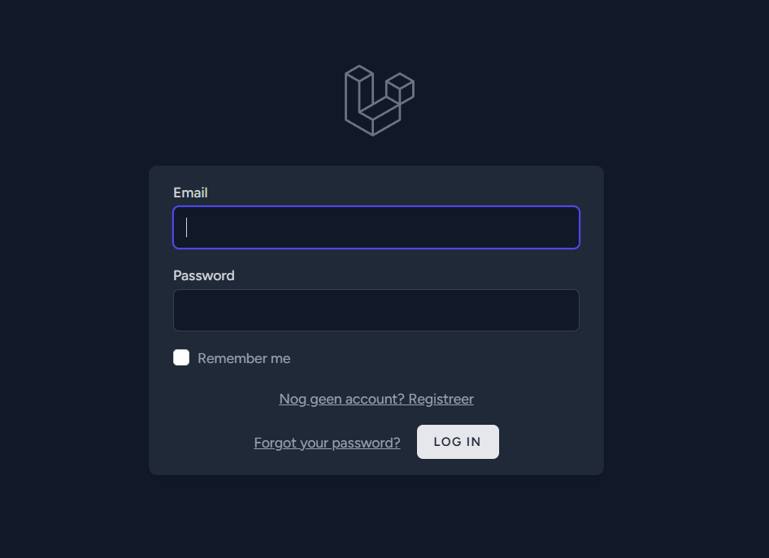
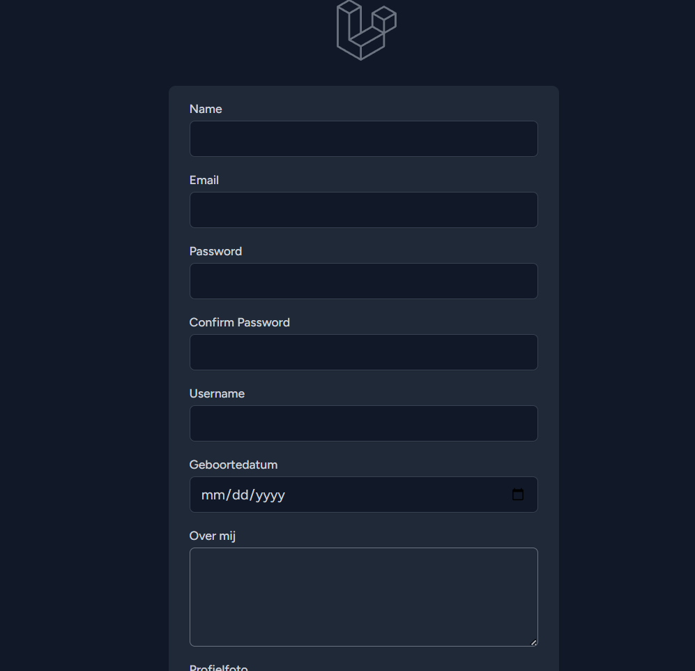
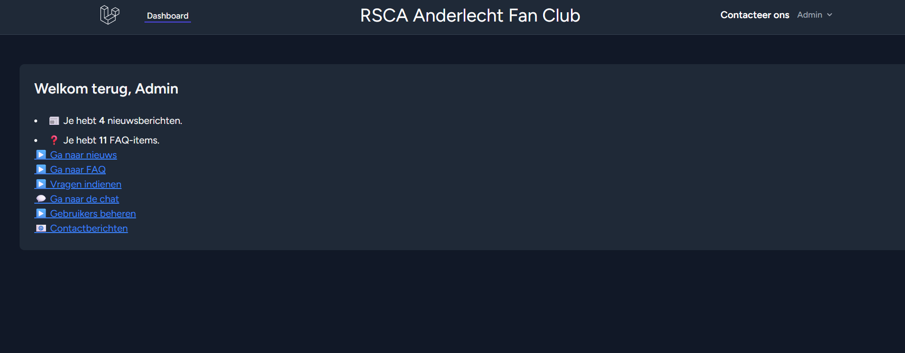
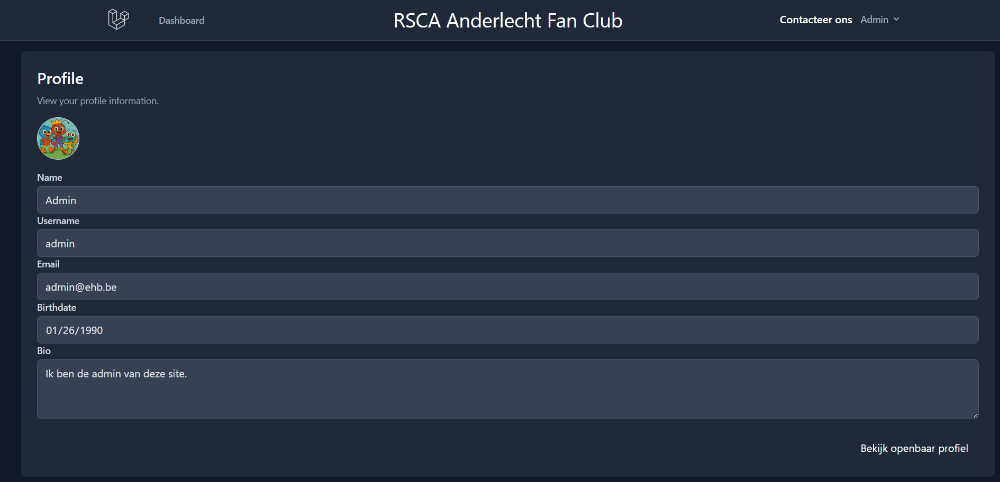
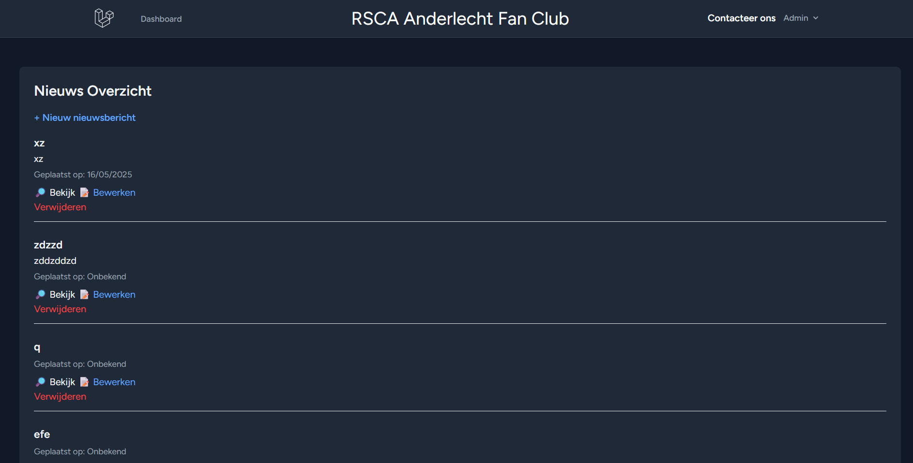
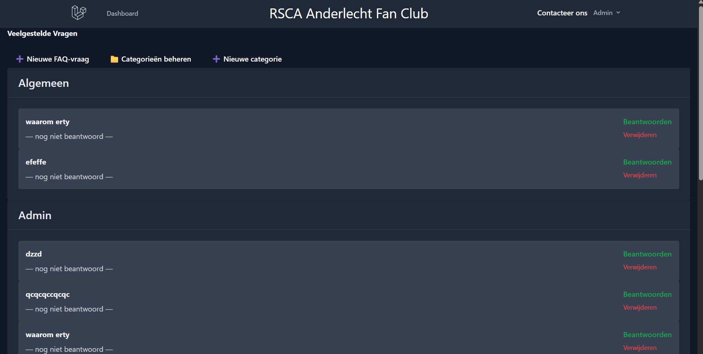

# RSCA Anderlecht Fan Club

Welkom op de officiële supporterswebsite van **RSCA Anderlecht Fan Club**!  
Dit platform is gebouwd als eindproject voor het vak **Backend Web** (graduaat Programmeren, EhB), en biedt fans een centrale plek voor nieuws, FAQ’s, chat en contact met de club.

## 🌟 Functionaliteiten

-   **Login/Registratie:** Veilige authenticatie voor alle gebruikers.
-   **Publiek profiel:** Elke gebruiker heeft een eigen profielpagina met bio, verjaardag en profielfoto.
-   **Nieuwsbeheer:** Admins kunnen nieuws toevoegen, aanpassen en verwijderen; bezoekers zien een overzicht & detailpagina.
-   **FAQ-pagina:** Vragen en antwoorden per categorie, beheerbaar door admins.
-   **Contactformulier:** Iedereen kan een bericht sturen naar de admin (simulatie).
-   **Openbare chat:** Gebruikers kunnen realtime met elkaar chatten, met naam en tijdstip bij elk bericht.
-   **Adminpanel:** Admins kunnen gebruikers beheren en rollen toekennen.
-   **Dark mode:** De hele site is standaard in dark mode.
-   **Responsief design:** Werkt op desktop én mobiel.

## 📁 Projectstructuur

Belangrijkste mappen/bestanden:
/app/Http/Controllers/

-   NewsController.php
-   FaqController.php
-   CategoryController.php
-   ProfileController.php
-   DashboardController.php
-   UserController.php
-   ChatController.php
-   MessageController.php
    /resources/views/
-   news/
-   faqs/
-   categories/
-   profile/
-   dashboard.blade.php
-   chat/
-   formulier/
-   layouts/
-   components/
    routes/web.php
    README.md
    > Bekijk de commits en broncode op GitHub:

## 🛠️ Technische vereisten: waar geïmplementeerd?

-   **Login/registratie:**  
    Breeze scaffolding. Zie: `routes/web.php`, `/app/Http/Controllers/Auth/`, `resources/views/auth/`
-   **Profielpagina’s:**  
    `ProfileController`, `resources/views/profile/`, profielmodel
-   **Nieuws (CRUD):**  
    `NewsController` (regels 10-89), `resources/views/news/`, `routes/web.php`
-   **FAQ + categorieën (one-to-many):**  
    `FaqController`, `CategoryController`, relatie gedefinieerd in model (`Faq` en `Category`). Zie `/database/migrations/`
-   **Contactformulier:**  
    `MessageController` (`show`, `send`, `index`), `resources/views/formulier/show.blade.php`
-   **Openbare chat:**  
    `ChatController`, `resources/views/chat/index.blade.php`
-   **Gebruikersbeheer:**  
    `UserController`
-   **Middleware & beveiliging:**  
    CSRF via Blade-directive, middleware in `routes/web.php`, input validatie in alle form-controllers
-   **Eloquent modellen en relaties:**  
    Zie `app/Models/`, bijv. User, News, Faq, Category, ContactMessage, ChatMessage
-   **Database:**  
    Migraties in `/database/migrations/`, seeders in `/database/seeders/`
-   **Dark mode:**  
    Tailwind classes `dark:` in alle views
-   **Commit-historiek:**  
    Zie commit messages in [GitHub](#)

> **Opmerking:** Voor exacte lijnnummers verwijs ik naar de meest recente commit in de repo. Wil je specifieke commits benoemd zien? Deel een lijstje met commitberichten of een link naar een commit-overzicht.

## 🚀 Installatiehandleiding

1. **Clone het project**
    ```bash
    git clone [https://github.com/NoahGoethals/backend-site1.git]
    cd backend-site1
    ```
2. **Installeer dependencies**
    ```bash
    composer install
    npm install && npm run build
    ```
3. **Kopieer de env-file**
    ```bash
    cp .env.example .env
    ```
4. **Genereer app key**
    ```bash
    php artisan key:generate
    ```
5. **Database instellen**  
   Pas `.env` aan voor jouw (sqlite of mysql) database.  
   Voor sqlite:
    ```bash
    touch database/database.sqlite
    ```
    Vul `.env` aan met:
    ```
    DB_CONNECTION=sqlite
    DB_DATABASE=database/database.sqlite
    ```
6. **Migraties en seeders uitvoeren**
    ```bash
    php artisan migrate:fresh --seed
    ```
7. **Start de server**
    ```bash
    php artisan serve
    ```
8. **Login met admin**
    - **Email:** admin@ehb.be
    - **Wachtwoord:** Password!321

## 📸 Screenshots

### Login



### Registratie



### Dashboard



### Profielpagina



### Nieuws



### FAQ



### Categorieën


## 🔗 Gebruikte bronnen

-   Laravel [https://laravel.com/](https://laravel.com/)
-   TailwindCSS [https://tailwindcss.com/](https://tailwindcss.com/)
-   [Stack Overflow](https://stackoverflow.com/)
-   [ChatGPT (OpenAI)](https://chat.openai.com/)
-   [Laravel Docs](https://laravel.com/docs/)

## 👨‍💻 Auteur

-   Noah Goethals
-   Graduaat Programmeren, EhB 2025

---

## ❓ Vragen / feedback?

Gebruik de **Contacteer ons** knop op de site!
